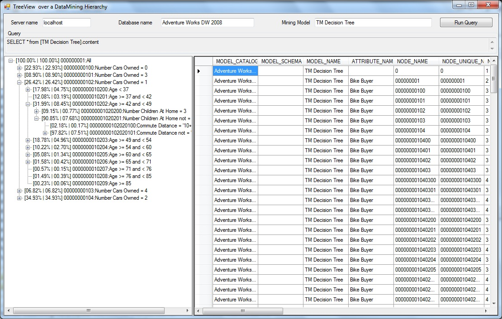

# DMmodelTreeView
DMmodelTreeView is a sample about using ADOMD.NET to extract information from a Data Mining model data set and present it using .NET Form controls. 

This sample c# application was created as a request to document how to access information from MS Analysis Services Data Mining models using ADOMD.NET.

Most of the sample deals with handling the user interface, validating input values and creating the hierarchical structure, for the TreeView control, from the data mining model data. The ADOMD.NET code used here is about 5 lines of code.

Hope you find the sample useful!!

Best regards,

JuanPablo